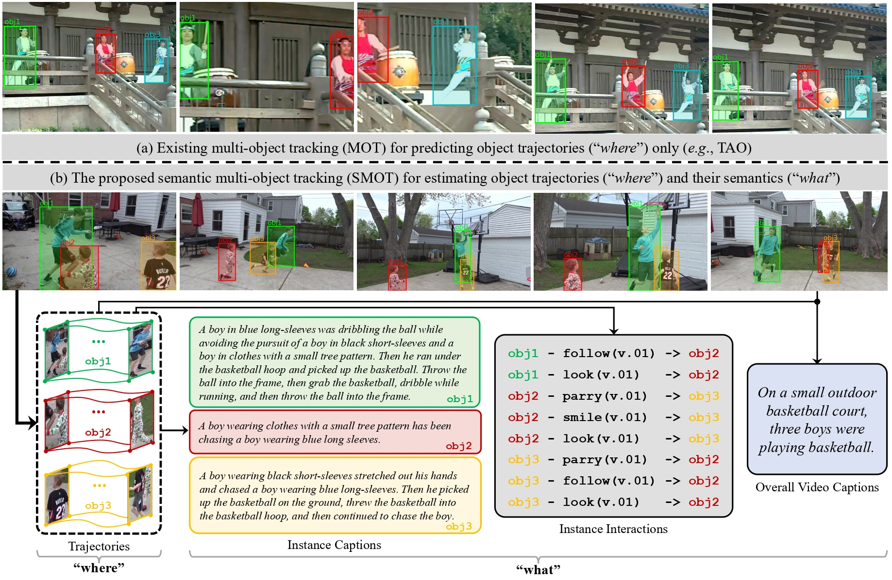
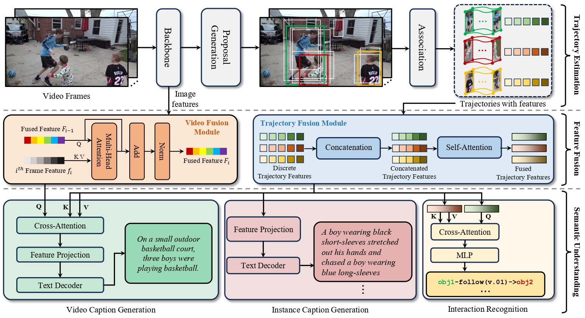

# Beyond MOT: Semantic Multi-Object Tracking
Beyond MOT: Semantic Multi-Object Tracking <br>
Yunhao Li, Hao Wang, Qin Li, Xue Ma, Jiali Yao, Shaohua Dong, Heng Fan, Libo Zhang <br>
[`arXiv`](https://arxiv.org/abs/2403.05021) [`Dataset`](https://mailsucasaccn-my.sharepoint.com/:f:/g/personal/liyunhao23_mails_ucas_ac_cn/Et6ORndJAJZIic2rIzA3VjYBgNwW58TUnsxVB61s9taJcg?e=FpLhAp)

## Semantic Multi-Object Tracking
---
 <br>
**Figure**: Illustration of the proposed Semantic **SMOT**. Existing multi-object tracking (MOT) focusing on predicting trajectories only (see (a)) and our semantic multi-object tracking (SMOT) aiming at estimating trajectories and understanding their semantics (see (b)). Best viewed in color for all figures.

## Framework
---
 <br>
**Figure**: : Illustration of the proposed approach **SMOTer**, which contains three components of trajectory estimation for tracking, feature fusion, and trajectory-associated semantic understanding.

## Implementation
---
### Installation
##### Requirements
- Linux or macOS with python >= 3.8
- Pytorch >= 1.10.0: this configuration is suitable for our V100 server, and theoretically, the PyTorch version only needs to be higher than 1.8.0.
- Detectron2: follow its [official instructions](https://detectron2.readthedocs.io/en/latest/tutorials/install.html).
##### Installation Example
```shell
conda create -n somter python=3.8.0
conda activate somter
pip install torch==1.10.0+cu111 torchvision==0.11.0+cu111 torchaudio==0.10.0 -f https://download.pytorch.org/whl/torch_stable.html

# under your working directory
git clone https://github.com/facebookresearch/detectron2.git
cd detectron2
pip install -e .

cd ..
# or git clone https://github.com/Nathan-Li123/SMOTer
git clone https://github.com/HengLan/SMOT
# or cd SMOTer
cd SMOT 
pip install -r requirements.txt
```
### Dataset preparation
1. Before starting the processing, please download BenSMOT from here ([baidu: yb2d](https://pan.baidu.com/s/1tw4Jw6y1426lTy8noOanjg), [one dirve](https://mailsucasaccn-my.sharepoint.com/:f:/g/personal/liyunhao23_mails_ucas_ac_cn/Et6ORndJAJZIic2rIzA3VjYBgNwW58TUnsxVB61s9taJcg?e=FpLhAp)) and place it anywhere you wish to. For more details about BenSMOT, please refer to [BenSMOT.md](BenSMOT.md). 
2. In the BenSMOT dataset folder, we provide semantic annotation files for each sequence in the dataset, including video captions, trajectory captions, and trajectory interactions. For convenience, we recommend downloading the combined annotation files from here ([baidu: 1b2h](https://pan.baidu.com/s/1-Moxeg8NrJqwfcv-rrS2bQ), [one drive](https://mailsucasaccn-my.sharepoint.com/:f:/g/personal/liyunhao23_mails_ucas_ac_cn/Evvg_GpNM7pBkfwe7fHaxFUBaLK1xxFFwmn8T5Pp86TPlA?e=CBa3xb)).
3. Sim-link the test set of BenSMOT to `datasets/bensmot/BenSMOT-val/`, and construct them as follows.
```text
datasets
├── bensmot
|   └──annotations
|   └──seqmaps
|   └──BenSMOT-val
|   └──instance_captioin.json
|   └──video_summary.json
|   └──relation.json
```
4. Modify the `DATA_PATH` in `tools/convert_bensmot2coco.py` to the BenSMOT root directory you are using.
5. run `tools/convert_bensmot2coco.py` to create `train.json` and `test.json`` files in the `annotations` folder, and create a `test.txt` file in the `seqmaps` folder. 

### Training and Evaluation
Please use the scripts provided in `scripts/bensmot.sh` for training and evaluation.
```shell
# train
CUDA_VISIBLE_DEVICES=0,1,2,3 python train_net.py --num-gpus 4 --config-file configs/BYTE_BENSMOT_FPN.yaml
# evaluation
CUDA_VISIBLE_DEVICES=0 python train_net.py --num-gpus 1 --config-file configs/BYTE_BENSMOT_FPN.yaml --eval-only path/to/weight
# count metrics
python eval_vu.py
```
### Acknowledgement
Our code repository is built upon [xingyizhou/GTR](https://github.com/xingyizhou/GTR). Thanks for their wonderful work.

### Citation
If you find this project useful for your research, please use the following BibTeX entry.
```text
@article{li2024beyond,
  title={Beyond MOT: Semantic Multi-Object Tracking},
  author={Li, Yunhao and Wang, Hao and Ma, Xue and Yao, Jiali and Dong, Shaohua and Fan, Heng and Zhang, Libo},
  journal={arXiv preprint arXiv:2403.05021},
  year={2024}
}
```
